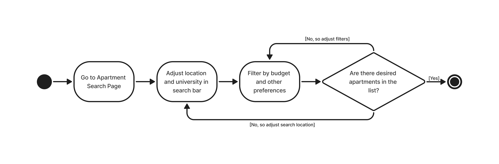

# Specification Phase Exercise : RoomWay

A little exercise to get started with the specification phase of the software development lifecycle. See the [instructions](instructions.md) for more detail.

## Team members
- Jasir Nawar - [jawarbx](https://github.com/jawarbx)
- Jean Marck - [jeanmarck12](https://github.com/jeanmarck12)
- John Ovalles - [jmo7728](https://github.com/jmo7728)
- Kazi Hossain - [kazisean](https://github.com/kazisean)
- Matthew Membreno - [m9membreno](https://github.com/m9membreno)

## Stakeholders

### Names

**Sabine Membreno (2nd-year Graduate College Student in NYC)**

The interview focused on the candidate's experience with finding housing and roommates during her graduate studies, as well as the current challenges she faces with her living arrangements. This approach allows our team to understand the specific needs of a graduate student, whose schedules, budgets, and preferences often differ from those of undergraduates. The candidate's six years of experience navigating the NYC housing market while juggling academic and work commitments make her an ideal source of insight. Her testimony helps us understand the complexities our users face when searching for compatible roommates and affordable housing.

**Dylan Membreno (2nd-year Undergraduate College Student in NYC)**

The discussion focused on the interviewee's entry into the NYC housing market as a freshman last year, including her current roommate situation and future housing plans. Because she is now a sophomore, she offers a fresh perspective on what college students look for in a property and in potential roommates. Furthermore, having lived in her current arrangement for a year, she can also provide valuable feedback on that experience.

## Goals Or Needs

### Find compatible roommates with similar lifestyles and budgets

Students need to connect with potential roommates who share their living preferences, social activity, study habits, sleeping patterns, noise regulation, cleanliness standards, and financial capabilities.

- **Sabine:** She would like options to find roommates who take their academic/work commitments seriously, avoiding late nights.
- **Dylan:** He wants roommates who are clear about scheduling and splitting groceries fairly from the start.

### Discover available rental properties within student budgets

College students require access to affordable housing, with a location that is either near campus or with good transportation links.

- **Dylan:** "I want to stop wasting time on apartment listings that don't fit my budget or location requirements."

### Coordinate group housing searches and applications

Once students find potential roommate matches on the app, they need tools to organize group viewings, share property listings, and coordinate application processes.

- **Sabine:** "It can be a nightmare getting to arrange viewing times with three or more people. I would use an app that gave the ability to do this effectively and efficiently. But having everything in one app would be super helpful"

### Verify roommate reliability and safety

Students need to ensure potential roommates are trustworthy and legitimate. The app should include basic verification features, reviews, or references from previous living situations to build confidence from users.

- **Dylan:** "It would be great to know their own experiences living with other roommates/apartments."

### Manage sharing housing logistics and expenses

Once housing is secured, students need ongoing roommate/landlord communication. In addition they need information on splitting rent, utilities, and other shared expenses.

- **Sabine:** "I likes the idea of digitally tracking who owes rent, internet, and groceries."

## Problems or Frustrations

### Current methods of finding roommates feel unsafe or unreliable

Current platforms like Facebook, Reddit, and Craigslist aren't tailored for students, so they lack adequate screening and compatibility-matching features. Students need a solution with a robust verification system to help them avoid unsafe or incompatible living situations.

- **Dylan:** "Facebook and Craigslist do not feel user friendly when I am searching for roommates."

### Housing search process feels overwhelming and time consuming

Searching across multiple websites, contacting different landlords, and coordinating with potential roommates is a fragmented and inefficient process. Students don't want to waste time managing communications across various platforms. The app should centralize these interactions, eliminating the need to synchronize schedules for viewings and applications by providing a single platform for all communication.

- **Sabine:** "On top of struggling with finding legitimate roommates, you have to juggle emails with several different landlords across different platforms."

### Limited transparency in shared housing costs and responsibilities

Students struggle with unclear expectations about payment arrangements. The app should provide a place where students can avoid conflicts and financial stress when roommates have different understandings of financial obligations.

- **Sabine:** "I have heard a ton of stories from friends about payment conflicts, especially since there are times where it has to be upfront."
- **Dylan:** "Initial communication is always going to be minimal since you're still getting to know each other. It usually means that things like splitting electricity costs or buying necessities can be complicated."

### Difficulty assessing roommate capability before committing

Traditional methods fail to provide deep insight into a potential roommate's living habits, personality, and lifestyle preferences. Without the ability to properly evaluate compatibility beforehand, students risk finding themselves in stressful or incompatible living situations.

- **Dylan:** "You usually get a sense of inauthenticity when conversing through texts. I would like a more thorough foundation of their kind of lifestyle before I waste my time."

### Lack of support for group decision-making in housing decision

Multiple students are trying to choose between different properties, or make group decisions about housing. The app should centralize a method of comparing options, gathering everyone's input, and reaching a consensus. Other platforms aren't streamlined for this and result in delayed decisions and missed opportunities for desired properties.

- **Sabine:** "It is naturally a race for some of these apartments. But also you need to be able to discuss the pros and cons with roommates as well."

## Product Vision Statement

At Roomway, we make it safe and simple to find like-minded roommates, so moving out becomes a step towards independence, comfort, and peace of mind. 

## User Requirements

- As a student nervous about compatibility, I want to be matched with a roommate who shares a similar lifestyle, so that we can live together comfortably.
- As a student with financial limitations, I want to see a list of apartments within my budget, so that I can find a home I can comfortably afford.
- As a student without a car, I want to see housing options near public transportation, so that I can have easy access to campus.
- As a college student, I want an easy way to communicate with potential roommates, so that we can start building a good relationship.
- As a student unfamiliar with NYC, I want to view neighborhood details alongside listings, so that I can make an informed decision about safety and convenience.
- As a student looking for housing with roommates, I want a shared space where we can post listings and vote on properties so that decision-making is easier and faster.
- As a student with a tight schedule, I want the app to help coordinate apartment viewings with my potential roommates so that we don’t struggle to align our calendars.
- As a student applying with roommates, I want tools to complete group applications digitally so that we don’t lose opportunities while waiting on paperwork.
- As a graduate student with prior bad roommate experiences, I want to see verified profiles of potential roommates so that I feel safe moving in with someone.
- As a student worried about scams, I want landlord and property verification so that I don’t waste money on fake listings.
- As a student moving into shared housing, I want to view references or reviews from past roommates so that I can make a confident choice.
- As a student splitting rent with multiple roommates, I want the app to automatically divide rent and utility bills so that everyone knows exactly what they owe.
- As a student living with new roommates, I want shared expenses and responsibilities documented in one place so that we avoid conflicts and confusion.
- As a student on a strict budget, I want payment reminders for rent and utilities so that I don’t fall behind.
- As a student searching for housing, I want to compare multiple properties side-by-side so that we can quickly decide which one fits best.
- As a student with indecisive roommates, I want a voting feature that shows consensus clearly so that we don’t lose housing opportunities.
- As a student navigating the overwhelming NYC housing market, I want all communication, listings, and decisions centralized in one app so that I don’t waste time on multiple platforms.

## Activity Diagrams
- **User Story 2**: As a student with financial limitations, I want to have a list of suitable apartments within my budget so that they are affordable.

- **User Story 13**: As a student splitting rent with multiple roommates, I want the app to automatically divide rent and utility bills so that everyone knows exactly what they owe.

## Wireframe diagrams

## Clickable Prototype

[RoomWay Prototype](https://www.figma.com/proto/1zver1NpNkG2FEtsTUgskR/Wireframe-Prototype)